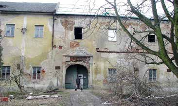
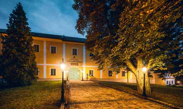

# Rychvaldský zámek

Památkový katalog eviduje rychvaldský zámek jako kulturní památku a jeho detailní záznam jej popisuje jako čtyřkřídlý dvojpodlažní renesanční zámek postavený v letech 1575–1577 Bernardem Barským z Baště.[^1][^11] Oficiální web města označuje zámek za nejstarší dochovanou stavbu Rychvaldu.[^12]

## Poloha

Objekt je v Památkovém katalogu identifikován adresou Orlovská 1, Rychvald.[^11]

Přesnost polohy:

- přesný objekt,[^11]
- způsob určení: evidenční záznam kulturní památky a odkaz na mapový portál NPÚ,[^11]
- zdroj polohy: `web-npu-rychvald-zamek-detail`.[^11]

Souřadnice zatím nejsou zapsány, protože nebyly samostatně odečteny a ověřeny.

## Historie

Dataci 1575–1577 shodně uvádějí detail Památkového katalogu a oficiální web města.[^11][^12] Stejné rozmezí je také ve zpravodaji z května 2025.[^4] Odborný text Muzea Těšínska datuje erbovní desky z rychvaldského kostela a zámku obecně do konce 16. století, což přesný rok neurčuje, ale zařazení do poslední čtvrtiny století podporuje.[^13]

Starší projektové prameny obsahují dvě odlišné varianty. Zpravodaj z dubna 2011 uvádí jako rok výstavby 1573.[^3] Listopadové číslo téhož ročníku však rozlišuje získání panství Burianem Barským roku 1573 a následnou výstavbu zámku jeho synem Bernardem ve druhé polovině 70. let 16. století.[^2] Textový přepis starší kroniky naproti tomu klade důkladnou obnovu či přestavbu původního zámku do roku 1595.[^5] Pracovní vyhodnocení proto považuje léta 1575–1577 za nejlépe doloženou dataci; rok 1573 za pravděpodobnou záměnu se získáním panství a rok 1595 za neověřenou kronikářskou variantu.[^2][^3][^5][^11][^12]

Po roce 1945 využívalo podle zpravodaje zámek místní JZD jako skladiště a byty; v letech 1962–1989 patřil podniku OKD, závod Rekultivace.[^6] Zpravodaj i oficiální web města uvádějí, že se roku 1988 uvažovalo o demolici zámku.[^6][^12]

V roce 2009 zámek koupil Pavel Šmíra a zahájil jeho celkovou rekonstrukci; zahájení záchranných prací v tomto roce potvrzuje také oficiální web města.[^7][^12] Podrobná zpráva z listopadu 2011 uvádí, že stavební práce začaly roku 2010 opravou střech, na něž byla použita štípaná břidlice.[^8] Při obnově byly podle stejného článku odkryty základy černé kuchyně, klenuté sály a zbytky fresek a psaníčkových sgrafit.[^8]

## Chronologie

| Rok nebo období | Událost | Zdroj |
|---|---|---|
| 1573 | Burian Barský podle zpravodaje získal rychvaldské panství. | `rz-2011-11`, s. 8[^2] |
| 1575–1577 | Nejlépe doložená datace výstavby zámku Bernardem Barským z Baště. | `web-npu-rychvald-zamek-detail`; `web-mesto-rychvald-o-meste`[^11][^12] |
| 1595 | Neověřená varianta důkladné přestavby pouze v textovém přepisu kroniky. | `kronika-ka631`, ř. 4564–4575[^5] |
| po roce 1945 | JZD využívalo objekt jako skladiště a byty. | `rz-2025-05`, s. 5[^6] |
| 1962–1989 | Zámek patřil podniku OKD, závod Rekultivace. | `rz-2025-05`, s. 5[^6] |
| 1988 | Podle zpravodaje a webu města se uvažovalo o demolici zámku. | `rz-2025-05`, s. 5; `web-mesto-rychvald-o-meste`[^6][^12] |
| 2009 | Zámek koupil Pavel Šmíra a začal s rekonstrukcí. | `rz-2025-05`, s. 5; `web-mesto-rychvald-o-meste`[^7][^12] |
| 2010 | Obnova začala opravou střech. | `rz-2011-11`, s. 11[^8] |
| 29. března 2026 | Na zámku se konal druhý velikonoční jarmark a návštěvníci si mohli prohlédnout zámecké komnaty. | `rz-2026-05`, s. 1[^10] |

## Současný stav

V květnu 2025 zpravodaj popsal zámek jako hotel s kapacitou 39 hostů a jako areál využívaný pro svatby a firemní akce.[^9] Květnové číslo zpravodaje z roku 2026 doložilo, že se zde 29. března konal druhý velikonoční jarmark a že část návštěvníků prošla zámecké komnaty.[^10] Tyto prameny dokládají využití objektu v uvedených termínech; neprokazují stálý režim veřejné přístupnosti.[^9][^10]

## Fotografie a mapy

*Zámek před obnovou. Autor: neuveden. Datum snímku: neznámé; zveřejněno v květnu 2025. Původ: `rz-2025-05`, s. 5.[^9] Držitel práv: neuveden. Licence: **neznámá práva**.*

*Zámek po obnově. Autor: neuveden. Datum snímku: neznámé; zveřejněno v květnu 2025. Původ: `rz-2025-05`, s. 5.[^9] Držitel práv: neuveden. Licence: **neznámá práva**.*

[Otevřít konkrétní mapové zobrazení zámku v geoportálu NPÚ](https://geoportal.npu.cz/portal/apps/experiencebuilder/experience/?id=5910233ff6974b608ccfcf5af7ea87e3&se=CP_Prstav_PVO&la=0&fk0=AktStav_id&fv0=18145009&zo=1). Odkaz pochází z detailu objektu v Památkovém katalogu.[^11] Autor mapového podkladu a držitel práv nejsou v detailu uvedeni; licenční stav je **neznámá práva**.

## Nejasnosti a rozpory

- Datace 1575–1577 je potvrzena dvěma současnými oficiálními zdroji; rok 1573 je pracovně vyhodnocen jako záměna s nabytím panství a rok 1595 zůstává neověřenou variantou textového přepisu kroniky.[^2][^3][^5][^11][^12]
- Úvahu o demolici roku 1988 potvrzuje zpravodaj i oficiální web města, nebyl však dohledán příslušný dobový správní dokument.[^6][^12]
- Památkový katalog eviduje stavebněhistorický průzkum z roku 2011 a restaurátorskou dokumentaci sgrafita z roku 2013; jejich obsah zatím nebyl prostudován, takže nálezy popsané ve zpravodaji nebyly nezávisle porovnány.[^8][^11]
- Aktuální podmínky návštěvy a provozu nebyly ověřeny; článek dokládá pouze konkrétní využití zachycené prameny z let 2025 a 2026.[^9][^10]
- Převzaté fotografie ani odkazovaný mapový podklad nemají ověřenou licenci; jsou proto označeny „neznámá práva“ a nesmějí být vydávány za volně použitelné.[^9][^11]

## Zdroje

[^1]: `web-npu-rychvald-zamek`, [Zámek – právní ochrana v Památkovém katalogu](https://pamatkovykatalog.cz/pravni-ochrana/zamek-132144), záhlaví záznamu, ověřeno 17. července 2026.
[^2]: `rz-2011-11`, [Rychvaldský zpravodaj 2011/11 (PDF, s. 8)](../../sources/zpravodaje/2011/zpravodaj-2011-11.pdf#page=8), článek „Rekonstrukce rychvaldského zámku je v plném proudu“.
[^3]: `rz-2011-04`, [Rychvaldský zpravodaj 2011/04 (PDF, s. 3)](../../sources/zpravodaje/2011/zpravodaj-2011-04.pdf#page=3), článek „Rychvald má co nabídnout nejen turistům, ale i místním aneb Kam vzít návštěvu?“.
[^4]: `rz-2025-05`, [Rychvaldský zpravodaj 2025/05 (PDF, s. 5)](../../sources/zpravodaje/2025/RZ-2025-5-web.pdf#page=5), oddíl „Slavná historie“.
[^5]: `kronika-ka631`, [textový přepis kroniky (TXT, ř. 4564–4575)](../../sources/kroniky/ka631_inv_c_bez_inventarniho_cisla_kn_1922_1935_Kronika_obce_Rychvald_kronika_rozdelena_na_useky_pr_prvni_dejiny_obce_svetova_valka_obecni_Pametni_kn.txt), oddíl „XII. Zámek Rychvald“; bez ověření proti obrazovému originálu.
[^6]: `rz-2025-05`, [Rychvaldský zpravodaj 2025/05 (PDF, s. 5)](../../sources/zpravodaje/2025/RZ-2025-5-web.pdf#page=5), oddíl „JZD, chátrání a hrozba demolice“.
[^7]: `rz-2025-05`, [Rychvaldský zpravodaj 2025/05 (PDF, s. 5)](../../sources/zpravodaje/2025/RZ-2025-5-web.pdf#page=5), oddíl „Nová éra“.
[^8]: `rz-2011-11`, [Rychvaldský zpravodaj 2011/11 (PDF, s. 11)](../../sources/zpravodaje/2011/zpravodaj-2011-11.pdf#page=11), pokračování článku „Rekonstrukce rychvaldského zámku je v plném proudu“.
[^9]: `rz-2025-05`, [Rychvaldský zpravodaj 2025/05 (PDF, s. 5)](../../sources/zpravodaje/2025/RZ-2025-5-web.pdf#page=5), popisky fotografií.
[^10]: `rz-2026-05`, [Rychvaldský zpravodaj 2026/05 (PDF, s. 1)](../../sources/zpravodaje/2026/RZ-2026-5-web.pdf#page=1), článek „Velikonoční jarmark mraky nerozehnal, ale všechny potěšil“.
[^11]: `web-npu-rychvald-zamek-detail`, [Zámek – detail objektu v Památkovém katalogu](https://pamatkovykatalog.cz/zamek-12895303), oddíly „Anotace“, „Památková ochrana“, „Zobrazení na mapě“ a seznam odborných dokumentů, ověřeno 19. července 2026.
[^12]: `web-mesto-rychvald-o-meste`, [O městě – Historie a Památky](https://rychvald.cz/o-meste/), oddíl „Památky“, ověřeno 19. července 2026.
[^13]: `web-muzeum-tesinska-heraldicke-pamatky`, [Karel Müller: Heraldické památky Těšínska (PDF, s. 9)](https://www.muzeumct.cz/images/E-p%C5%99ed%C3%A1%C5%A1ky/Tesinsko_v_promenach_staleti-15-Heraldicke_pamatky.pdf#page=9), ověřeno 19. července 2026.
